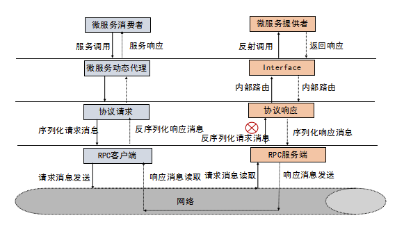

## 说明

### 协议框架
1. 定义消息协议
2. 定义编解码器
3. 定义序列化

### 服务提供者
1. 实现接口
2. 启动netty服务端
3. 收到请求后找到对应的实现，通过反射调用

### 服务消费者
1. 创建代理对象
2. 在代理对象中启动netty客户端，发送请求数据

###

### 引入注解
* @RpcService  
  服务提供者启动时会启动netty服务端，并扫描注解类向注册中心进行注册（服务地址和端口），同时本地会保存一份，调用时通过名字找到对应的类进行反射调用。

* @RpcReference  
  服务消费者启动时扫描注解，创建代理对象并注册到容器中。代理对象通过注册中心发现服务，再通过netty客户端发送调用请求。